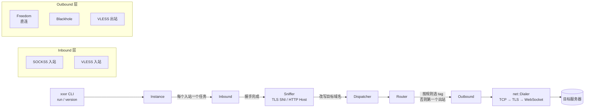

# xxxr — Xray-core 的 Rust 重写

`xxxr` 是用 Rust 重写的 [Xray-core](https://github.com/XTLS/Xray-core)。目标是：**配置文件兼容、
协议行为对齐**，但用 Rust 的类型系统与 `async`/`await` 生态重新实现，追求可维护与可测试。

- **参考上游版本**：Xray-core **v26.9.30**（行为、字段命名、字节序均以该版本源码为准）。
- **当前进度**：workspace 基线 + 域名嗅探 / 路由增强（见下方「实现矩阵」）。
- **配置兼容**：直接读取 Xray 的 JSON 配置（`log` / `inbounds` / `outbounds` / `routing`），
  协议名与传输名使用小写字符串 tag，未知字段一律忽略。

## 架构



关键抽象（`crates/proxy`）：

| 接口 | 作用 |
|---|---|
| `InboundHandler` | 监听端口、完成入站协议握手、调用嗅探、交给分发器 |
| `OutboundHandler` | 拨号到目标地址，并在入站连接与远端之间双向转发 |
| `Dispatcher` | 维护 `tag → outbound` 表，按路由结果选择出站 |
| `SessionContext` | 会话上下文：入站 tag、来源、目标（原始 / 嗅探 / 拨号）、协议 |

## 实现矩阵

| 能力 | 状态 | 说明 |
|---|---|---|
| SOCKS5 入站 | ✅ CONNECT | BIND / UDP-ASSOCIATE 返回 `command not supported` |
| VLESS 入站 | ✅ TCP (v0) | UUID 校验；`flow` / `decryption != none` / `fallbacks` 未实现 |
| Freedom 出站 | ✅ | 直连目标 |
| Blackhole 出站 | ✅ | 直接关闭连接（`response` 字段忽略） |
| VLESS 出站 | ✅ TCP | `vnext` 仅取第一个 server/user |
| Trojan 入站 | ✅ CONNECT | SHA-224(password) 认证 + CRLF 请求头；UDP 与 `fallbacks` 未实现 |
| Trojan 出站 | ✅ | `servers[]` 轮询；TLS 由 `streamSettings` 决定 |
| VMess 入站 | ✅ AEAD (TCP) | `aes-128-gcm` / `chacha20-poly1305`；含 AuthID 时间窗与重放过滤 |
| VMess 出站 | ✅ AEAD (TCP) | `vnext` 取第一个；支持 `AuthenticatedLength` 实验项 |
| 传输：TCP | ✅ | `streamSettings.network = "tcp"` |
| 传输：WebSocket | ✅ | `"ws"`；无 permessage-deflate |
| 传输：TLS | ✅ | `security = "tls"`；ring provider，支持 `allowInsecure` |
| 域名嗅探 | ✅ TLS / HTTP | `sniffing.enabled` / `destOverride` / `domainsExcluded` / `routeOnly` |
| 路由条件 | ✅ inboundTag / domain / ip / port / network / source / protocol | `regexp:` 需正则可编译；`geosite:` / `geoip:` 无数据时跳过整条规则并告警 |
| 路由 `domainMatcher` | ✅ hybrid / regexp | 兼容上游旧字段 |
| CLI | ✅ `run` / `version` | `SIGINT` 与 `SIGTERM` 走同一优雅关闭路径 |
| xhttp / gRPC / QUIC / Reality | ❌ | 未实现 |
| UDP 代理（含 SOCKS5 UDP ASSOCIATE、Trojan/VMess UDP） | ❌ | 未实现 |
| Shadowsocks | ❌ | 未实现 |
| Mux / XTLS-Vision / fallbacks / VMess Mux | ❌ | 未实现 |
| fake DNS、`metadataOnly`、`ipsExcluded` | ❌ | 未实现 |
| 统计 / 限速 / API | ❌ | 未实现 |

## 目录结构

```
crates/common   错误类型（thiserror）与 tracing 日志初始化
crates/net      Address、Conn、Dialer/Listener、TCP/WebSocket/TLS 传输、Prefixed 流
crates/config   Xray JSON 模型、匹配原语（domain/ip/port）、加载与校验
crates/proxy    协议层：入站/出站 trait 与 SOCKS5、VLESS、Freedom、Blackhole、嗅探
crates/app      装配层：Router、Dispatcher、Instance、CLI（二进制名 `xxxr`）
```

## 构建与使用

```bash
cargo build --release
./target/release/xxxr version
./target/release/xxxr -c config.json run
```

最小配置（SOCKS5 入站 + 直连出站）：

```json
{
  "log": { "loglevel": "warning" },
  "inbounds": [
    {
      "tag": "socks-in",
      "listen": "127.0.0.1",
      "port": 1080,
      "protocol": "socks",
      "settings": { "auth": "noauth" }
    }
  ],
  "outbounds": [
    { "tag": "direct", "protocol": "freedom", "settings": {} }
  ]
}
```

启用嗅探并按域名分流（`routeOnly: true` 时只影响路由，不改写实际拨号目标）：

```json
{
  "inbounds": [
    {
      "tag": "socks-in",
      "listen": "127.0.0.1",
      "port": 1080,
      "protocol": "socks",
      "settings": { "auth": "noauth" },
      "sniffing": {
        "enabled": true,
        "destOverride": ["tls", "http"],
        "routeOnly": true,
        "domainsExcluded": ["domain:example.com"]
      }
    }
  ],
  "outbounds": [
    { "tag": "blocked", "protocol": "blackhole", "settings": {} },
    { "tag": "direct", "protocol": "freedom", "settings": {} }
  ],
  "routing": {
    "domainMatcher": "hybrid",
    "rules": [
      {
        "type": "field",
        "inboundTag": ["socks-in"],
        "domain": ["domain:trusted.example", "full:api.example"],
        "port": "443,8000-8100",
        "outboundTag": "direct"
      }
    ]
  }
}
```

> 未被任何规则命中的流量走 **第一个出站**；因此把 `blackhole` 放在首位即「默认拒绝」。

## 测试与持续集成

所有编译与测试都在 GitHub Actions 中执行（`.github/workflows/rust.yml`）：

```
cargo fmt --all --check
cargo clippy --all-targets -- -D warnings
cargo build --workspace
cargo test --workspace
```

测试覆盖：嗅探解析单测（TLS ClientHello / HTTP Host，含任意截断的边界用例）、路由条件单测
（端口段、network、full/domain/keyword/regexp、规则顺序优先级）、协议单测（Trojan 线格式、
VMess KDF/头部/chunk 分帧与篡改检测，含上游 Go 实现生成的固定向量）、集成测试
（SOCKS5→Freedom、VLESS→Freedom、Trojan→Freedom、VMess→Freedom、TLS 嗅探→按域名路由）、
CLI 冒烟测试。

> 本仓库的开发环境约束：本地只允许 `cargo fmt`，编译/测试/clippy 一律交由 CI 验证。
> 依赖锁定文件 `Cargo.lock` 由 CI 构建产出并作为构建附件回传。

## 与上游的关系

- 配置 schema、协议字节序、路由条件语义均对齐 Xray-core v26.9.30；例如 VLESS/VMess 的地址
  为「端口在前」（ATYP `1/2/3`），而 SOCKS5/Trojan 为「地址在前、端口在后」（ATYP `1/4/3`）。
- VMess 的 `KDF` 复刻了上游自引用 HMAC 的语义（非普通嵌套 HMAC），并用上游 Go 实现生成的
  固定向量做了回归校验。
- 未实现的能力在上表中显式列出，不提供静默降级的占位实现：遇到不支持的配置会给出明确错误
  或告警（例如 `geosite:` 条件会跳过整条规则并记录 warning）。

## 许可证

MIT OR Apache-2.0